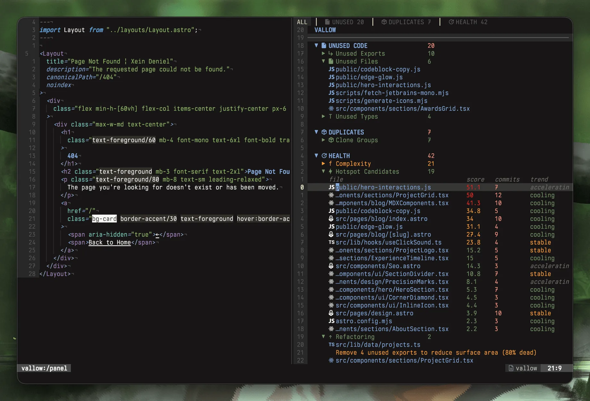
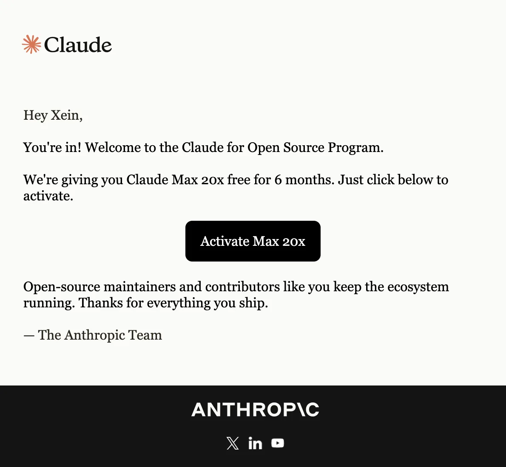

import { Cite, Ref, References } from "@/components/blog/MDXComponents";

Over a year ago, I didn't know what a dotfile was.

I grew up on Windows. No opinions about editors, no `.config` folder I cared about, no idea people spent evenings tuning tools instead of using them. Then I installed WSL to poke at Linux and fell down the Ubuntu rabbit hole. Ghostty, then tmux, then vim.

Somewhere in there I stopped reaching for the mouse and started living on the keyboard. Eventually I bought a Mac because I wanted the real Unix underneath, not a subsystem bolted onto an OS that fights you at every turn.

That year rewired how I think about tools. You stop being a person who *uses* software and start being a person who *shapes* it. And once you cross that line, you notice the gaps — the thing your editor almost does, the workflow that's one plugin away from being right.

For me, the gap was dead code.

---

## The itch

I kept shipping code with loose ends. An exported function nobody imported. A type that outlived its last use. A circular dependency quietly forming between two modules.

None of it broke the build. All of it added up.

There are tools that find this stuff, but they live in a terminal, in a separate window, a context switch away from where I actually work. I wanted the answers *in the editor*, in a split, next to the code they were about.

So I built **vallow.nvim**.<Cite n={1} />

It brings static analysis straight into Neovim<Cite n={2} />: unused exports, dead code, circular deps, duplicate exports, complexity hotspots — all in a native split. Under the hood it's powered by **fallow**, a Rust analysis engine that does the heavy lifting.<Cite n={3} /> The plugin itself is Lua, and it's deliberately unfussy: no LSP, no tree-sitter, no config to get started.

That screenshot is vallow running on the codebase for *this site*. It's flagging the exact loose ends I'd let pile up: three helper scripts nothing imports, a component I'd built and never wired in, and a data file where 80% of the exports were dead.

The constraint I'm proudest of is the "no config" part. Every tool in this space eventually grows a settings file that becomes its own small project to maintain. I wanted the opposite — a thing you install and forget.

---

## The part I didn't plan for

I built vallow for myself. That was the whole scope. I had the itch, I scratched it, I used it every day.

Then I did the one thing that turned a personal tool into something more: I put it online. MIT licensed, open for contributions, a README that explained what it was for.

Not because I had a grand plan. Just because shipping felt like the honest end of building.

That's what got me into **Claude for Open Source**.

Six months of Claude Max 20x, for a Neovim plugin I made on evenings and weekends. I'm still a little stunned by the math. The project cost me a lot of Lua I had to learn as I went. The return was a door I didn't know existed.

---

## Dogfooding, all the way down

Here's the part that makes me grin.

The engine behind vallow — fallow — I've been running it on this site the whole time. It's how I found a sound-effect module I'd duplicated across two files, a dependency my icon script relied on by accident, and a 190-line button I'd copy-pasted instead of turning into a component.

The tool I built to keep my code honest keeps *this* code honest too. Build a thing, use the thing, let the thing improve the next thing. That loop is the whole reason any of this is worth doing.

---

## The only advice I have

If you've been sitting on a side project — even one you built purely for yourself, even one you're sure nobody else wants — ship it anyway. Push the repo. Write the README. Add the license.

> Open source rewards you in ways you don't expect.

I mean that literally. I expected to keep a plugin for an audience of one. Instead I got six months of the best tools I've ever worked with, and a reason to keep building in the open.

Start your Unix journey. Learn what a dotfile is. And when you make something — anything — don't let it die on your hard drive.

---

[Read the original post on LinkedIn](https://www.linkedin.com/posts/xeind_over-a-year-ago-i-didnt-know-what-a-dotfile-ugcPost-7483940267692122112-tsvT/)

<References>
  <Ref n={1} href="https://github.com/xeind/vallow.nvim">
    vallow.nvim — the Neovim plugin, MIT licensed and open for contributions
  </Ref>
  <Ref n={2} href="https://neovim.io">
    Neovim — the editor vallow.nvim runs inside
  </Ref>
  <Ref n={3} href="https://docs.fallow.tools">
    fallow — the Rust static-analysis engine behind vallow
  </Ref>
</References>
